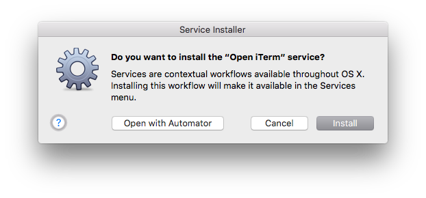
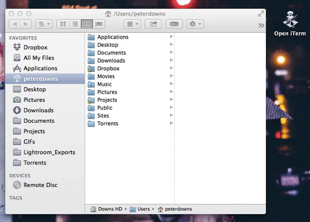

# Open iTerm2 from the Finder
This is the up-to-date code accompanying [my blogpost about opening iTerm2
directly from the
Finder](http://peterdowns.com/posts/open-iterm-finder-service.html).

### Version support
This repository includes a pre-built Finder service and a pre-built
application; these work with "moden" iTerm2 (version 2.9+). If you're using an
older version of iTerm2, you'll have to run the build scripts to get a version
that works for you. See the instructions below.

### Installation

##### Finder Service
Double click `Open iTerm.workflow` and click "Install"



You can add a keyboard shortcut for this service by going to `System
Preferences > Keyboard > Shortcuts > Services > Files and Folders`.


Unfortunately, it seems that this keyboard shortcut will only work if iTerm2 is
already running.

##### Finder Menu Tool
You can move the built `Open iTerm.app` anywhere you'd like, or leave it here;
add it to your Finder toolbar by dragging it in while holding the command and
option keys.



### Build
Build the application and Finder service like this:

```bash
$ python build.py
```

The build script will detect which version of iTerm2 you have installed and
automatically use the right applescript -- `*.modern.applescript` for version
2.9+, and `*.applescript` for older versions.

The build script should work with both Python 2 and Python 3.
